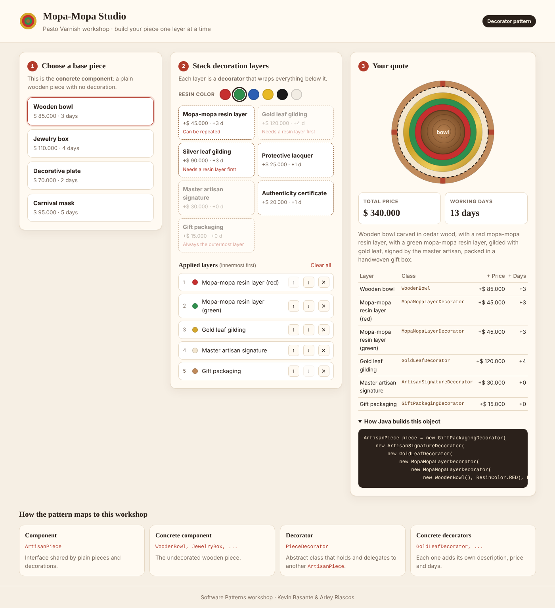
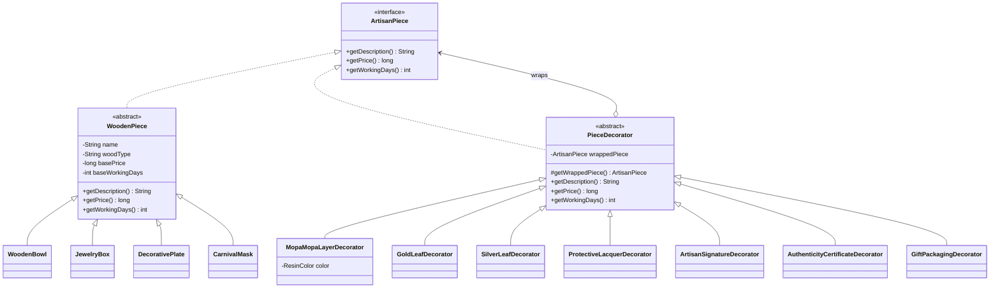

# Mopa-Mopa Studio — Patrón Decorator

**Taller Patrón Decorator · Patrones de Software**
**Integrantes:** Kevin Basante · Arley Riascos
**Lenguaje:** Java 17+ (backend) · HTML, CSS y JavaScript (frontend)



---

## 1. Caso de estudio

El **Barniz de Pasto (mopa-mopa)** es una técnica artesanal de Nariño, Colombia, reconocida por la UNESCO como Patrimonio Cultural Inmaterial. El artesano parte de una pieza de madera tallada y le va aplicando capas:

1. Láminas de resina **mopa-mopa** teñidas de colores (se pueden poner varias).
2. Hoja de **oro** o **plata** sobre la resina (*barniz brillante*).
3. **Laca** protectora.
4. **Firma** del maestro artesano y **certificado** de autenticidad.
5. Por último, el **empaque** de regalo.

**Mopa-Mopa Studio** es el cotizador del taller. El cliente elige una pieza base, apila capas en el orden que quiera, y el sistema calcula la descripción, el precio en pesos colombianos (COP) y los días de trabajo artesanal.

### ¿Por qué Decorator?

Cada capa **envuelve** literalmente a la anterior y le **agrega** algo (precio, días y descripción) sin modificar la pieza original. Si lo resolviéramos con herencia necesitaríamos una clase por cada combinación (`BowlWithRedResinAndGoldAndLacquer`…), lo cual es inmanejable. Con Decorator las combinaciones se arman **en tiempo de ejecución**:

```java
ArtisanPiece piece = new GiftPackagingDecorator(
        new GoldLeafDecorator(
            new MopaMopaLayerDecorator(new WoodenBowl(), ResinColor.RED)));

piece.getPrice();       // 265000 -> 85.000 + 45.000 + 120.000 + 15.000
piece.getWorkingDays(); // 10
```

---

## 2. Roles del patrón

| Rol del patrón | Clase(s) en el proyecto | Equivalente en el ejemplo de clase |
|---|---|---|
| **Component** (interfaz) | `ArtisanPiece` | `MusicPlayer` |
| **Concrete Component** | `WoodenBowl`, `JewelryBox`, `DecorativePlate`, `CarnivalMask` (heredan de `WoodenPiece`) | `SimpleMusicPlayer` |
| **Decorator** (abstracto) | `PieceDecorator` | `MusicPlayerDecorator` |
| **Concrete Decorators** | `MopaMopaLayerDecorator`, `GoldLeafDecorator`, `SilverLeafDecorator`, `ProtectiveLacquerDecorator`, `ArtisanSignatureDecorator`, `AuthenticityCertificateDecorator`, `GiftPackagingDecorator` | `EqualizerDecorator` |
| **Client** | `QuoteService`, `ConsoleDemo` | `Main` |

### Diagrama de clases (UML)



> GitHub dibuja este diagrama automáticamente al abrir el README.

---

## 3. Arquitectura

```
Navegador (frontend)                    Servidor Java (backend)
┌──────────────────────┐   GET /api/catalog   ┌───────────────────────────────┐
│ index.html           │ ───────────────────▶ │ web.CatalogHandler            │
│ styles.css           │                      │                               │
│ app.js               │   GET /api/quote     │ web.QuoteHandler              │
│ (elige pieza y capas)│ ───────────────────▶ │   └─ service.QuoteService     │
│                      │ ◀─────── JSON ────── │        └─ arma la cadena de   │
└──────────────────────┘                      │           decoradores         │
                                              └───────────────────────────────┘
```

- El **frontend** solo guarda lo que el usuario elige. **Toda** la lógica (precios, días, reglas) vive en Java, en los decoradores.
- El servidor usa `com.sun.net.httpserver.HttpServer`, que viene incluido en el JDK, así que el proyecto **no tiene dependencias externas**.

### Estructura de carpetas

```
mopa-mopa-studio/
├── README.md
├── GUIA_COMMITS.md            ← reparto de clases y commits entre los dos integrantes
├── pom.xml                    ← para abrirlo en IntelliJ / NetBeans / Eclipse (Maven)
├── run.sh / run.bat           ← compilar y ejecutar sin Maven
├── Dockerfile                 ← imagen para desplegar en la nube
├── docs/screenshot.png
└── src/main/
    ├── java/com/mopamopa/studio/
    │   ├── Main.java                     (punto de entrada)
    │   ├── ConsoleDemo.java              (demo por consola, estilo del ejemplo de clase)
    │   ├── component/                    (Component + Concrete Components)
    │   │   ├── ArtisanPiece.java
    │   │   ├── WoodenPiece.java
    │   │   ├── WoodenBowl.java
    │   │   ├── JewelryBox.java
    │   │   ├── DecorativePlate.java
    │   │   └── CarnivalMask.java
    │   ├── decorator/                    (Decorator + Concrete Decorators)
    │   │   ├── PieceDecorator.java
    │   │   ├── MopaMopaLayerDecorator.java
    │   │   ├── GoldLeafDecorator.java
    │   │   ├── SilverLeafDecorator.java
    │   │   ├── ProtectiveLacquerDecorator.java
    │   │   ├── ArtisanSignatureDecorator.java
    │   │   ├── AuthenticityCertificateDecorator.java
    │   │   └── GiftPackagingDecorator.java
    │   ├── model/                        (enums del catálogo)
    │   │   ├── ResinColor.java
    │   │   ├── PieceType.java
    │   │   └── DecorationType.java
    │   ├── service/                      (lógica de cotización y reglas)
    │   │   ├── WorkshopCatalog.java
    │   │   ├── DecorationRequest.java
    │   │   ├── QuoteService.java
    │   │   ├── Quote.java
    │   │   ├── QuoteStep.java
    │   │   └── InvalidOrderException.java
    │   └── web/                          (servidor HTTP y API REST)
    │       ├── WebServer.java
    │       ├── ApiHandler.java
    │       ├── CatalogHandler.java
    │       ├── QuoteHandler.java
    │       ├── StaticFileHandler.java
    │       └── JsonSerializer.java
    └── resources/static/                 (frontend)
        ├── index.html
        ├── styles.css
        └── app.js
```

---

## 4. Cómo ejecutarlo

**Requisito:** JDK 17 o superior (`java -version`).

### Opción A: scripts (sin Maven)

```bash
# Linux / macOS / Git Bash
./run.sh              # aplicación web
./run.sh --console    # demo por consola

# Windows (CMD o doble clic)
run.bat
run.bat --console
```

Después abrir **http://localhost:8080** en el navegador. Para usar otro puerto: `./run.sh --port=9090`.

### Opción B: desde el IDE

1. Abrir la carpeta del proyecto en IntelliJ IDEA / NetBeans / Eclipse (se importa como proyecto Maven por el `pom.xml`).
2. Ejecutar la clase `com.mopamopa.studio.Main`.
3. Abrir http://localhost:8080.

### Opción C: Maven

```bash
mvn package
java -jar target/mopa-mopa-studio-1.0.0.jar
```

### Opción D: Docker

```bash
docker build -t mopa-mopa-studio .
docker run -p 8080:8080 mopa-mopa-studio
```

### Despliegue en la nube (Render)

La aplicación está preparada para la nube: lee el puerto de la variable de entorno `PORT` e incluye un `Dockerfile`.

1. Crear una cuenta gratuita en https://render.com (se puede entrar con GitHub).
2. **New → Web Service** → conectar el repositorio de GitHub.
3. Render detecta el `Dockerfile` automáticamente. Elegir el plan **Free** y crear el servicio.
4. Al terminar el despliegue, Render entrega una URL pública del tipo `https://<nombre>.onrender.com`.

> En el plan gratuito el servicio se duerme tras 15 minutos sin visitas; la primera visita después tarda cerca de un minuto en despertarlo.

### Salida de la demo por consola

```
Plain piece:
  Description : Wooden bowl carved in cedar wood
  Price       : $85.000 COP
  Working days: 3

Decorated bowl:
  Description : Wooden bowl carved in cedar wood, with a red mopa-mopa resin layer, with a green mopa-mopa resin layer, gilded with gold leaf, packed in a handwoven gift box
  Price       : $310.000 COP
  Working days: 13
...
```

---

## 5. Uso del frontend

1. **Elegir la pieza base** (componente concreto).
2. **Elegir un color** de resina y **agregar capas** (decoradores). Se pueden reordenar con ↑ ↓ o quitar con ✕.
3. Ver la **cotización**:
   - una vista previa donde **cada anillo es un decorador** que envuelve a los de adentro;
   - el precio total y los días de trabajo;
   - el desglose de lo que aporta cada clase;
   - **el código Java equivalente** que construye ese objeto (`new GiftPackagingDecorator(new GoldLeafDecorator(...))`).

### Reglas del taller (validadas en `QuoteService`)

| Regla | Mensaje |
|---|---|
| La hoja de oro o plata va sobre una capa de resina | *must be applied over a mopa-mopa resin layer* |
| Solo la capa de resina puede repetirse | *can only be applied once* |
| El empaque de regalo siempre es la capa externa | *must be the last layer* |
| La capa de resina necesita un color | *needs a resin color* |
| Máximo 10 capas por pedido | *An order can have at most 10 layers* |

Si se viola una regla (por ejemplo, al mover la hoja de oro por debajo de la resina), el backend responde con HTTP 400 y el frontend muestra el mensaje.

### API REST

| Método | Ruta | Descripción |
|---|---|---|
| GET | `/api/catalog` | Piezas, capas y colores disponibles |
| GET | `/api/quote?piece=BOWL&layers=MOPA_MOPA_LAYER:RED,GOLD_LEAF` | Cotiza la pieza con las capas en ese orden |

---

## 6. Principios de Programación Orientada a Objetos aplicados

| Principio | Dónde se aplica |
|---|---|
| **Abstracción** | `ArtisanPiece` define *qué* hace una pieza sin decir *cómo*. `WoodenPiece`, `PieceDecorator` y `ApiHandler` son clases abstractas. |
| **Encapsulamiento** | Todos los atributos son `private final`, se exponen con getters y se validan en el constructor (`WoodenPiece`, `MopaMopaLayerDecorator`). La pieza envuelta solo se ve a través de `getWrappedPiece()` (protegido). |
| **Herencia** | Las piezas concretas heredan de `WoodenPiece`; los decoradores, de `PieceDecorator`; los handlers, de `ApiHandler`. |
| **Polimorfismo** | `QuoteService` trabaja siempre con `ArtisanPiece`, sin importar si es una pieza simple o una cadena de 10 decoradores. Cada decorador sobrescribe (`@Override`) los tres métodos. |
| **Composición sobre herencia** | `PieceDecorator` **tiene un** `ArtisanPiece` y delega en él (corazón del patrón). |
| **Responsabilidad única** | El catálogo crea objetos, el servicio valida y cotiza, los handlers hablan HTTP, el serializador solo escribe JSON. |
| **Abierto/Cerrado** | Para agregar una capa nueva (por ejemplo, grabado láser) se crea un decorador nuevo sin tocar las piezas ni los otros decoradores. |

---

## 7. Ventajas y desventajas observadas

**Ventajas**
- Combinaciones ilimitadas de capas sin explosión de subclases.
- Se pueden apilar varios decoradores iguales (dos capas de resina de distinto color).
- Cada decorador es pequeño y fácil de entender y de probar.

**Desventajas**
- Con muchas capas aparecen muchos objetos pequeños (hasta 11 por pedido).
- El **orden importa**: no es lo mismo oro sobre resina que resina sobre oro. Por eso se necesitan validaciones extra en `QuoteService`.
- Depurar una cadena larga puede ser confuso; por eso el frontend muestra la expresión `new ...(new ...)` completa.

---

## 8. Trabajo en equipo

El reparto de clases y el orden de los commits está en **[GUIA_COMMITS.md](GUIA_COMMITS.md)**.

| Integrante | Responsabilidad |
|---|---|
| **Kevin Basante** | Núcleo del patrón: interfaz `ArtisanPiece`, piezas concretas, decorador abstracto, 3 decoradores concretos, enums del modelo, `Main`/`ConsoleDemo`, HTML y CSS. |
| **Arley Riascos** | 4 decoradores concretos, capa de servicio (cotización y reglas), servidor web y API REST, lógica del frontend (`app.js`) y scripts de ejecución. |
